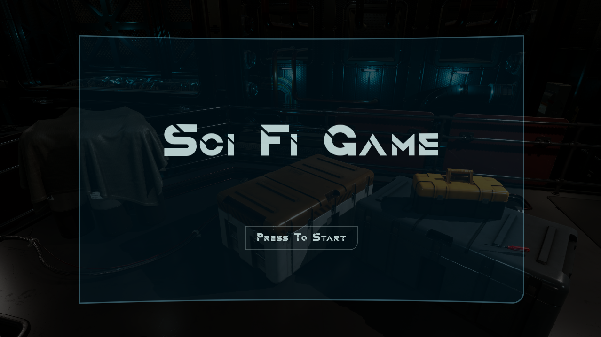
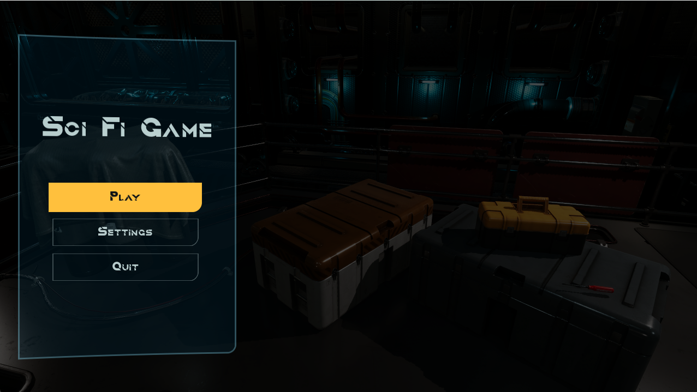
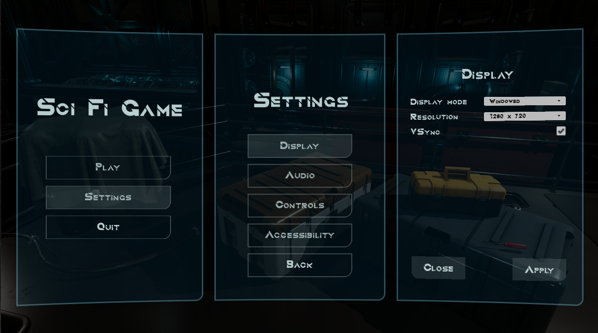
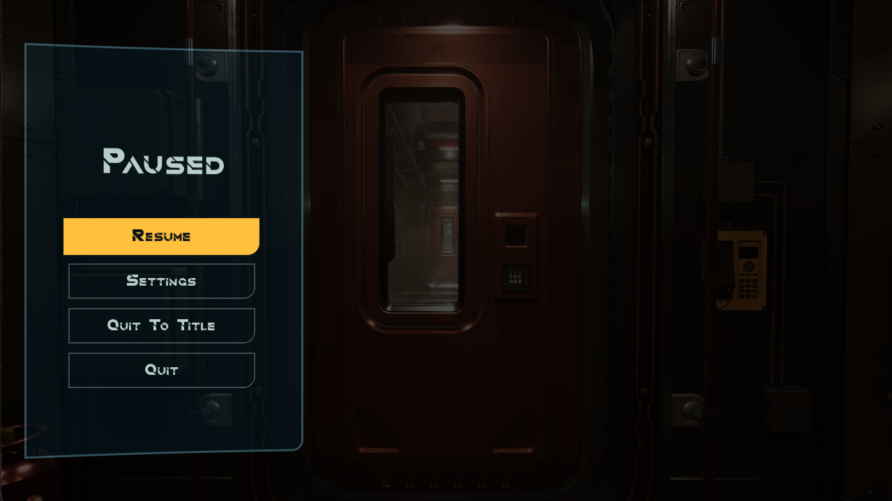
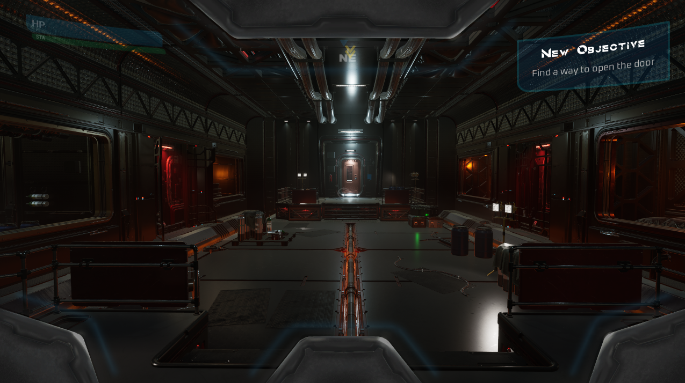
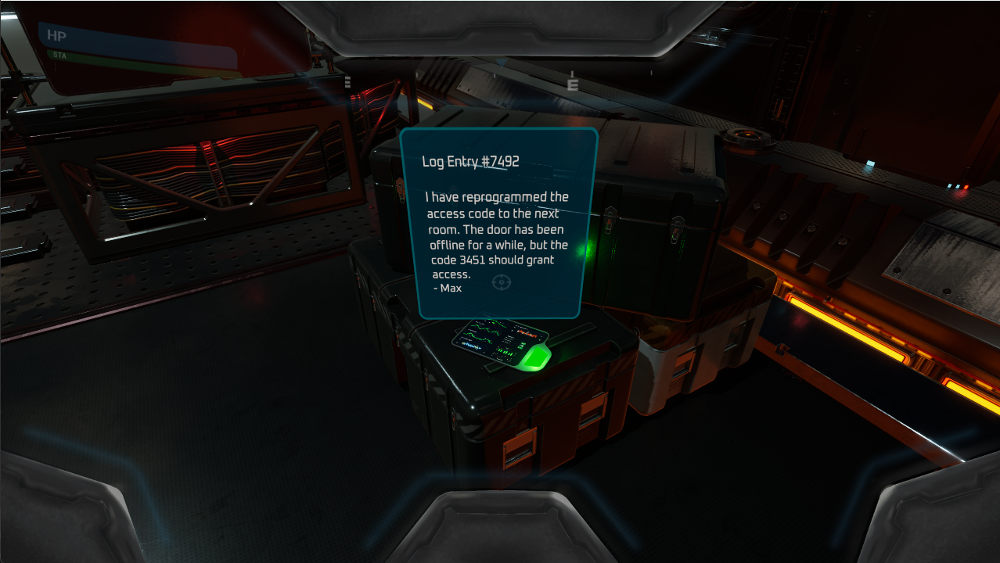
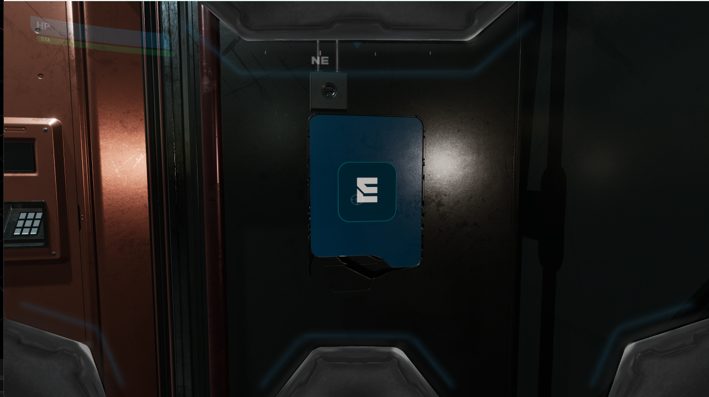
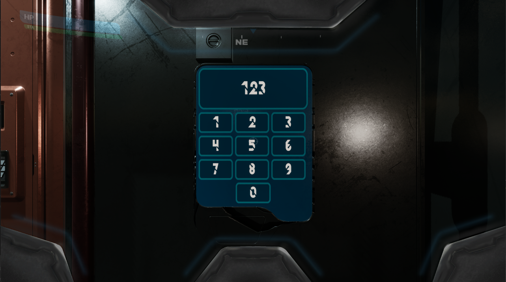

# Personal Gameproject
 
This project is for me to enhance my skills and to show what I have learned thus far. 

# Controls

WASD - Movement
E - Interact
C - Close log/Cancel 
ESC - Pause
J - Show Current Objective

# Images

Title screen

Main menu

Settings

Pause menu

Player HUD

Log

Keypad 1

Keypad 2
